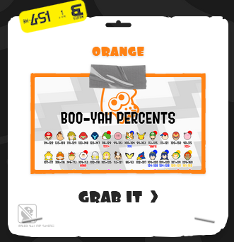

# `boo-yah.ink`
> Hosting the image files for the Inklingcord's Boo-Yah Doc!

![License][license-shield]
![Stars][stars-shield]
# 

This website is a shortcut to the boo-yah document, and it's respective files.
- Use the `img.boo-yah.ink` subdomain for a catalog of the graphics!
- `boo-yah.ink` redirects to the google doc for you.

## Usage
### To access the doc
Simply go to `boo-yah.ink` and you will automatically be redirected to the google doc.

### To access all of the graphics
Go to `img.boo-yah.ink` to see a list of links to each of the images.

### To access a direct link to one of the graphics
The images are located at `img.boo-yah.ink/{color}.png`. Replace `color` with the color of the inkling alt you want.

## Acknowledgements

Huge thanks to **Kise** [![Kise][kise-shield]](https://twitter.com/KiseSeryuu_AOA/) and **Saff** [![Saff][saff-shield]](https://twitter.com/Big_Saffron/) for the doc and images respectively.

Give em a follow! :heart:

---

Contact me · [**@LeptoFlare**](https://github.com/LeptoFlare) · [lepto.tech](https://lepto.tech)

As always, distributed under the MIT license. See `LICENSE` for more information.

_[https://github.com/LeptoFlare/boo-yah.ink](https://github.com/LeptoFlare/boo-yah.ink)_

<!-- markdown links & imgs -->
[stars-shield]: https://img.shields.io/github/stars/LeptoFlare/boo-yah.ink.svg?style=social
[license-shield]: https://img.shields.io/github/license/LeptoFlare/boo-yah.ink.svg?style=flat
[kise-shield]: https://img.shields.io/twitter/follow/KiseSeryuu_AOA?style=social
[saff-shield]: https://img.shields.io/twitter/follow/Big_Saffron?style=social
